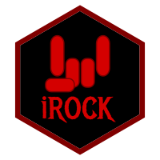

<!-- README.md is generated from README.Rmd. Please edit that file -->

<!-- badges: start -->

[](https://cran.r-project.org/package=rock)
[](https://cran.r-project.org/package=rock)
[](https://cran.r-project.org/package=rock)
<!-- [](https://CRAN.R-project.org/package=rock) -->
<!-- badges: end -->

#  rock 📦

## Reproducible Open Coding Kit

The pkgdown website for this project is located at
<https://rock.opens.science>.

<!--------------------------------------------->

<!-- Start of a custom bit for every package -->

<!--------------------------------------------->

The Reproducible Open Coding Kit (‘ROCK’, and this package, ‘rock’) was
developed to facilitate reproducible and open coding, specifically
geared towards qualitative research methods. It was developed to be both
human- and machine-readable, in the spirit of MarkDown and ‘YAML’. The
idea is that this makes it relatively easy to write other functions and
packages to process ‘ROCK’ files. The ‘rock’ package contains functions
for basic coding and analysis, such as collecting and showing coded
fragments and prettifying sources, as well as a number of advanced
analyses such as the Qualitative Network Approach and
Qualitative/Unified Exploration of State Transitions. The ‘ROCK’ and
this ‘rock’ package are described in the ROCK book (Zörgő & Peters,
2022; <https://rockbook.org>, in Zörgő & Peters (2024;
[doi.org/jrfb](https://doi.org/10.1080/21642850.2022.2119144)), and
Peters, Zörgő and van der Maas (2022;
[doi.org/hwzj](https://doi.org/10.31234/OSF.IO/CVF52)), and more
information and tutorials are available at <https://rock.science>.

<!--------------------------------------------->

<!--  End of a custom bit for every package  -->

<!--------------------------------------------->

## Installation

You can install the released version of `rock` from
[CRAN](https://CRAN.R-project.org) with:

``` r
install.packages('rock');
```

You can install the development version of `rock` from
[Codeberg](https://codeberg.org) with:

``` r
remotes::install_git('https://codeberg.org/r-packages/rock');
```

(assuming you have `remotes` installed; otherwise, install that first
using the `install.packages()` function)

<!--------------------------------------------->

<!-- Start of a custom bit for every package -->

<!--------------------------------------------->

<!-- ## References -->

<!-- van Woerkum, C. and Aarts, N. (2012), ‘Accountability: New challenges, new forms’, *Journal of Organizational Transformation & Social Change*, 9, pp. 271–283, \doi{10.1386/jots.9.3.271_1}. -->

<!--------------------------------------------->

<!--  End of a custom bit for every package  -->

<!--------------------------------------------->

<!--  https://stackoverflow.com/questions/4822471/count-number-of-lines-in-a-git-repository    -->

<!--  cloc $(git ls-files) -->
